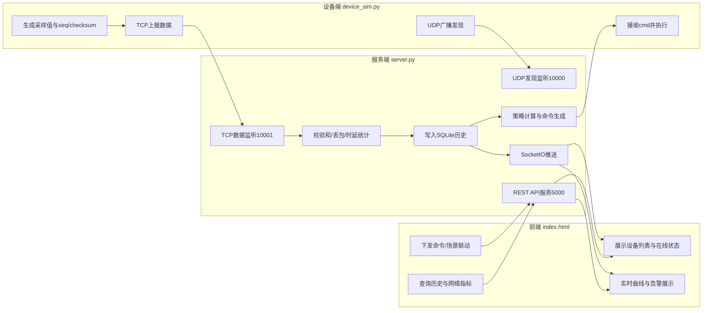
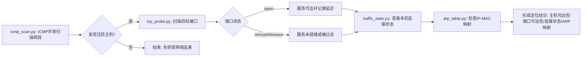
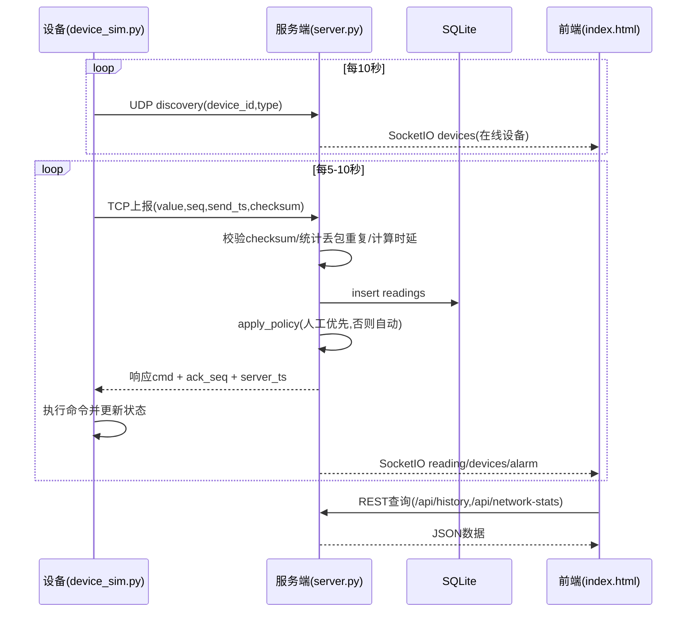

# 智能家居CPS 流程图汇总

## 1. 系统主流程图

```mermaid
flowchart TD
    A[启动 server.py] --> B[初始化SQLite与Flask-SocketIO]
    B --> C[并发启动三个线程]
    C --> C1[UDP发现监听:10000]
    C --> C2[TCP数据服务:10001]
    C --> C3[设备超时清理]
    C --> D[启动Web服务:5000]

    E[启动 device_sim.py] --> E1[每设备线程1: UDP广播发现]
    E --> E2[每设备线程2: 周期生成传感数据]

    E1 --> C1
    C1 --> F[更新设备在线状态]
    F --> G[SocketIO推送设备列表到前端]

    E2 --> H[构造上报JSON: device_id/type/value/seq/send_ts/checksum]
    H --> I[TCP发送到服务器]
    I --> C2

    C2 --> J{校验与统计}
    J --> J1[checksum校验]
    J --> J2[seq统计丢包/重复]
    J --> J3[计算时延]

    J3 --> K[写入SQLite历史readings]
    K --> L[策略引擎apply_policy]
    L --> M{是否有人工待执行命令}
    M -->|有| N[优先执行人工命令]
    M -->|无| O[按设备类型自动策略]

    O --> O1[light/temp: 自动开关]
    O --> O2[door/smoke: 告警策略]
    O --> O3[plug: 仅手动]

    N --> P[返回响应JSON: cmd/ack_seq/server_ts]
    O1 --> P
    O2 --> P
    O3 --> P

    P --> Q[设备执行命令并更新本地状态]
    Q --> E2

    K --> R[SocketIO推送reading/devices/alarm]
    R --> S[index.html实时刷新设备/曲线/告警/网络指标]

    D --> T[前端REST接口调用]
    T --> T1[/api/devices]
    T --> T2[/api/history]
    T --> T3[/api/network-stats]
    T --> T4[/api/command与场景接口]
```

## 2. 三泳道流程图（设备端/服务端/前端）



## 3. 网络诊断工具链流程图



## 4. 闭环时序图（设备上报-策略回执-前端展示）


